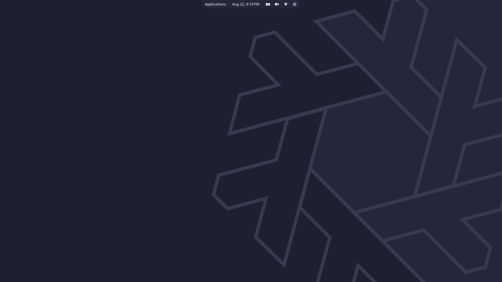

# dotfiles



Personal dotfiles for a NixOS + COSMIC + Limine setup. Fish or Zsh shell,
Alacritty, Catppuccin theming, COSMIC shortcuts, and an imperative-feeling
`pkg` manager for `/etc/nixos/packages.nix`.

## What's in here

- `fish/` — fish shell config (functions, including the `pkg` command)
- `.zshrc` — zsh config, used when installing in zsh mode
- `alacritty.toml` — Alacritty terminal config
- `catppuccinize.py` — theming helper
- `cosmic-shortcuts.ron` — custom COSMIC keyboard shortcuts
- `install.sh` — installer that wires all of the above into place (fish or zsh mode)

Not tracked here (machine-specific, set up manually):

- `cosmic.ron` and wallpaper — import via `cosmic-settings` GUI
- `hardware-configuration.nix` — generate per-machine with
  `nixos-generate-config`, lives in `/etc/nixos`, not this repo

## Requirements

- NixOS, with `nix.settings.experimental-features = [ "nix-command" "flakes" ];`
- COSMIC desktop (`services.desktopManager.cosmic.enable = true;`)
- Limine bootloader
- fish installed (or zsh, if using zsh mode)
- Nvidia GPU config as shipped — swap for your driver's equivalent if you're
  on AMD or Intel

This is built around that stack specifically. Swap out COSMIC or Limine and
you're not really running these dots anymore — fork and adapt as needed.

## Install

```bash
git clone https://github.com/void01n/dotss.git ~/dotss
cd ~/dotss
chmod +x install.sh   # only needed if the exec bit didn't survive clone/download
./install.sh [fish or zsh]
```

What it does:

1. **fish mode** (default): copies `fish/` to `~/.config/fish/`
   **zsh mode**: installs `.zshrc` to `~/.zshrc`
2. Copies `alacritty.toml` to `~/.config/alacritty/alacritty.toml`
3. Copies `catppuccinize.py` to `~/.config/shell/catppuccinize.py`
4. Copies `cosmic-shortcuts.ron` into COSMIC's custom shortcuts path
5. On NixOS, sets up `/etc/nixos/packages.nix` as a self-contained module (if
   it doesn't already exist) and wires it into `/etc/nixos/configuration.nix`'s
   `imports`, then runs `nixos-rebuild build` to sanity-check the result
6. Prints reminders to import `cosmic.ron` and your wallpaper manually via
   `cosmic-settings`

Every install target is backed up first as `<file>.bak.<timestamp>` (or
`<dir>.bak.<timestamp>` for directories) before being overwritten, so nothing
existing gets clobbered silently.

Safe to re-run — existing files just get backed up again and replaced.

## `pkg` — imperative-feeling package manager

Once installed, `pkg` is available in fish for managing
`/etc/nixos/packages.nix` without hand-editing it:

```bash
pkg install <name> [name...]   # validate + add to packages.nix
pkg remove <name> [name...]    # remove from packages.nix
pkg remove <name> --rorphs     # also remove now-orphaned runtime deps (asks to confirm)
pkg list                       # list installed packages
pkg import                     # pull in anything installed imperatively via `nix profile`
pkg orphan add <anchor> <companion>   # mark <companion> as an orphan-tracked dep of <anchor>
pkg orphan rm <anchor> <companion>    # remove that tracking
```

`pkg orphan` requires `sqlite`, which backs the anchor/companion tracking used
by `--rorphs`.

Every `install` / `remove` / `import` run ends with `nixos-rebuild switch`.
If that succeeds, the change is auto-committed and pushed from `/etc/nixos`.
If the rebuild fails, nothing gets committed.

## Notes

- Requires `sudo` for anything touching `/etc/nixos`.
- `/etc/nixos` should already be a git repo with a remote you can push to, or
  the auto-push step in `pkg` will just warn and move on.
- `x86_64-linux` is assumed throughout `pkg`.
